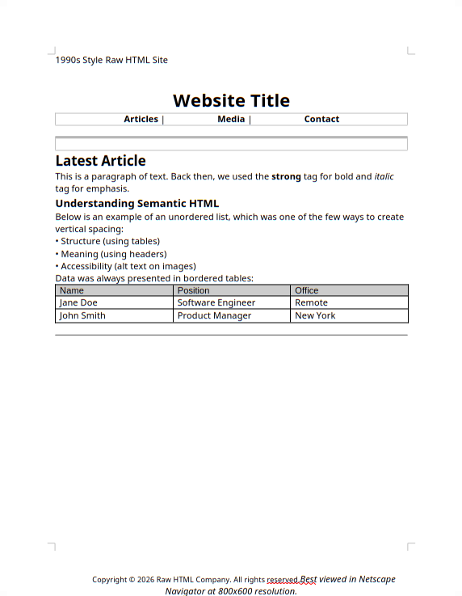
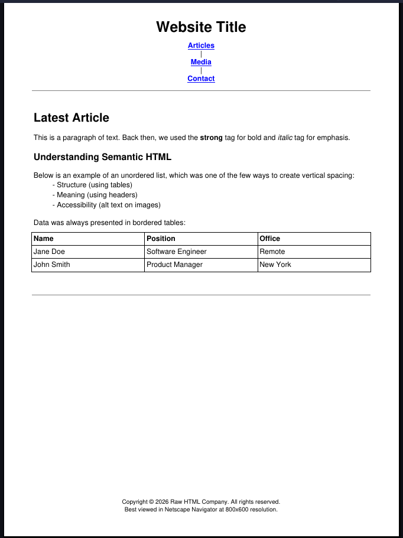

# html2docx

[](https://pkg.go.dev/github.com/achiket/html2docx)

A pure Go library for converting raw HTML into **DOCX**, **PDF**, and **Markdown** — no external dependencies like LibreOffice required.

## Features

- **HTML → DOCX** — headings, tables, lists, text formatting, headers/footers
- **HTML → PDF** — pure Go via [gofpdf](https://github.com/jung-kurt/gofpdf), with UTF-8 support, centered layout tables, and pinned footers
- **HTML → Markdown** — clean Markdown output with tables, lists, and inline formatting

## Installation

```bash
go get github.com/achiket/html2docx/converter
```

## Usage

### HTML to DOCX

```go
package main

import (
    "fmt"
    "github.com/achiket/html2docx/converter"
)

func main() {
    htmlContents := []string{`<html><body><h1>Hello</h1><p>World</p></body></html>`}

    conv := converter.NewHTMLToDocxConverter()
    if err := conv.Convert(htmlContents); err != nil {
        fmt.Printf("Error: %v\n", err)
        return
    }
    if err := conv.SaveToFile("output.docx"); err != nil {
        fmt.Printf("Error: %v\n", err)
    }
}
```

### HTML to PDF

```go
pdfConv := converter.NewHTMLToPDFConverter()
if err := pdfConv.Convert(htmlContents); err != nil {
    fmt.Printf("Error: %v\n", err)
    return
}
pdfConv.SaveToFile("output.pdf")
```

### HTML to Markdown

```go
// Direct file output
converter.ConvertHTMLToMarkdown(htmlContents, "output.md")

// Or get the string
mdConv := converter.NewHTMLToMarkdownConverter()
markdown, err := mdConv.Convert(htmlContents)
```

## Supported HTML Elements

| Element | DOCX | PDF | Markdown |
|---------|------|-----|----------|
| Headings (h1-h6) | ✅ | ✅ | ✅ |
| Paragraphs | ✅ | ✅ | ✅ |
| Bold / Italic / Underline | ✅ | ✅ | ✅ |
| Tables (data + layout) | ✅ | ✅ | ✅ |
| Lists (ordered + unordered) | ✅ | ✅ | ✅ |
| Links | ✅ | ✅ | ✅ |
| Horizontal rules | ✅ | ✅ | ✅ |
| Font styling | ✅ | ✅ | — |
| Headers / Footers | ✅ | ✅ | — |
| Center alignment | ✅ | ✅ | — |
| Images | — | — | ✅ |
| Code / Blockquotes | — | — | ✅ |

## Project Structure

```
html2docx/
├── converter/          # Importable package
│   ├── helpers.go      # Shared utilities
│   ├── export_docx.go  # DOCX converter
│   ├── export_pdf.go   # PDF converter
│   └── export_md.go    # Markdown converter
├── cmd/html2docx/      # Example CLI
│   └── main.go
├── go.mod

## Outputs

### DOCX



### PDF



### Markdown


## License

MIT License. See [LICENSE](LICENSE) for details.
